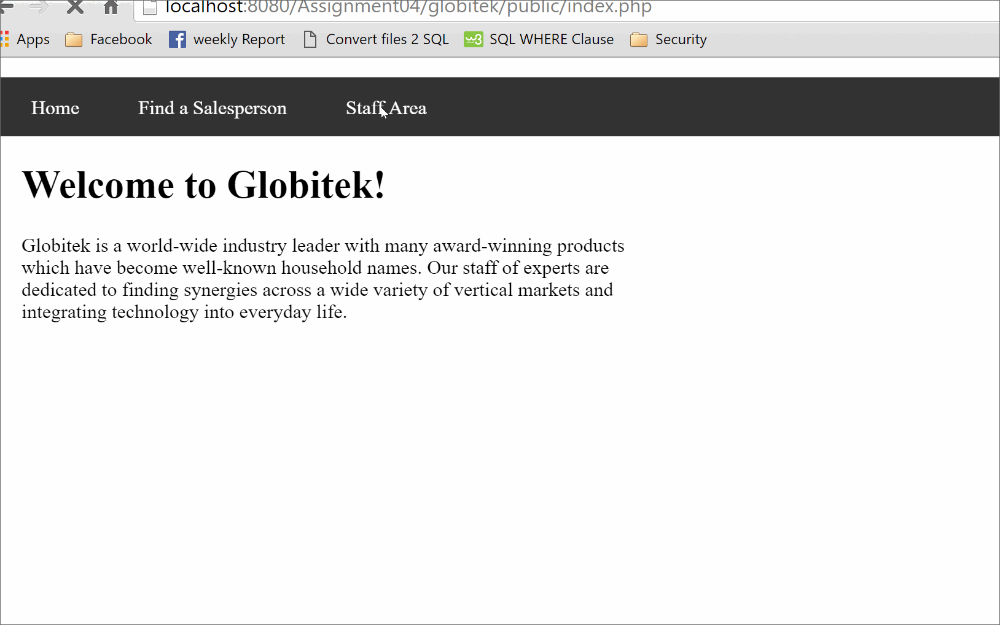

# #  Project 4: Authentication and Login Throttling

Time spent: **38** hours spent in total

## User Stories

The following **required** functionality is completed:

- [ ] 1. On the existing pages "public/staff/users/new.php" and "public/staff/users/edit.php", a user should see:
- [ ] 2. For both users/new.php and users/edit.php, submitting the form performs data validations:
- [ ] 3. If all validations on the user data pass:
- [ ] 4. Notice that login and logout pages already exist ("public/staff/login.php" and "public/staff/logout.php") and have the CSRF tokens and other protections added last week.
- [ ] 5. If a user fails to log in:
- [ ] 6. After any successful login:

The following advanced user stories are optional:

- [ ] Bonus 3:

## Video Walkthrough

Here's a walkthrough of implemented user stories:

GIF created with [LiceCap](http://www.cockos.com/licecap/).

## Notes

The biggest challenge was the fifth story, "if a user fails to log in."

## License

    Copyright [2016] [Tiffany Benjamin]

    Licensed under the Apache License, Version 2.0 (the "License");
    you may not use this file except in compliance with the License.
    You may obtain a copy of the License at

        http://www.apache.org/licenses/LICENSE-2.0

    Unless required by applicable law or agreed to in writing, software
    distributed under the License is distributed on an "AS IS" BASIS,
    WITHOUT WARRANTIES OR CONDITIONS OF ANY KIND, either express or implied.
    See the License for the specific language governing permissions and
    limitations under the License.
